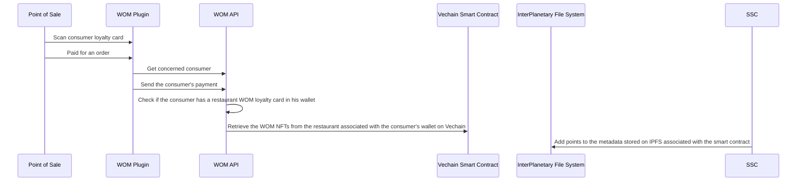

# Loyalty Program add points on program Sequence Diagram

## Detailed Explanation of the Diagram:

### Point of Sale (POS)

- The POS is where the transaction begins. It scans the consumer's loyalty card and processes payment for an order.

### WOM Plugin (WP)

- After the card is scanned and the payment is processed, the WOM Plugin gathers details about the concerned consumer and forwards the payment information.

### WOM API (WA)

- The WOM API receives the information from the WOM Plugin. It performs a check to confirm whether the consumer possesses a WOM loyalty card for the restaurant in their wallet.

### Vechain Smart Contract (VSC)

- If the consumer has a loyalty card, The Vechain Smart Contract is then queried by the WOM API to interact with the WOM NFTs associated with the consumer's wallet, specifically those related to the restaurant. This is achieved using tools like [@vechain/sdk-network](https://www.npmjs.com/package/@vechain/sdk-wallet), [@vechain/sdk-network](https://www.npmjs.com/package/@vechain/sdk-network) packages.

### InterPlanetary File System (IPFS)

- The Vechain Smart Contract interacts with IPFS to add points to the metadata stored on IPFS, which is linked to the smart contract managing the loyalty points, thus updating the consumer’s loyalty status effectively.
