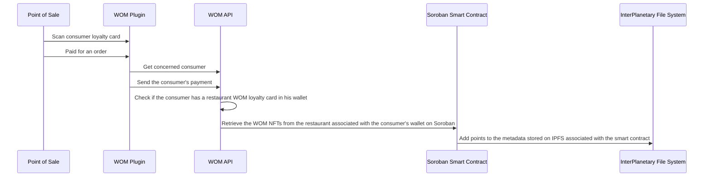

# Loyalty Program add points on program Sequence Diagram

```mermaid

sequenceDiagram
    participant POS as Point of Sale
    participant WP as WOM Plugin
    participant WA as WOM API
    participant SSC as Soroban Smart Contract
    participant IPFS as InterPlanetary File System

    POS->>WP: Scan consumer loyalty card
    POS->>WP: Paid for an order
    WP->>WA: Get concerned consumer
    WP->>WA: Send the consumer's payment
    WA->>WA: Check if the consumer has a restaurant WOM loyalty card in his wallet
    WA->>SSC: Retrieve the WOM NFTs from the restaurant associated with the consumer's wallet on Soroban
    SSC->>IPFS: Add points to the metadata stored on IPFS associated with the smart contract

```

## Detailed Explanation of the Diagram:

### Point of Sale (POS)

- The POS is where the transaction begins. It scans the consumer's loyalty card and processes payment for an order.

### WOM Plugin (WP)

- After the card is scanned and the payment is processed, the WOM Plugin gathers details about the concerned consumer and forwards the payment information.

### WOM API (WA)

- The WOM API receives the information from the WOM Plugin. It performs a check to confirm whether the consumer possesses a WOM loyalty card for the restaurant in their wallet.

### Soroban Smart Contract (SSC)

- If the consumer has a loyalty card, the WOM API communicates with the Soroban Smart Contract using NodeJs [stellar-sdk](https://www.npmjs.com/package/@stellar/stellar-sdk). to retrieve the WOM NFTs associated with the consumer's wallet, specifically those linked to the restaurant.

### InterPlanetary File System (IPFS)

- The Soroban Smart Contract then interacts with IPFS to add points to the metadata associated with the smart contract, effectively updating the consumer's loyalty points.
