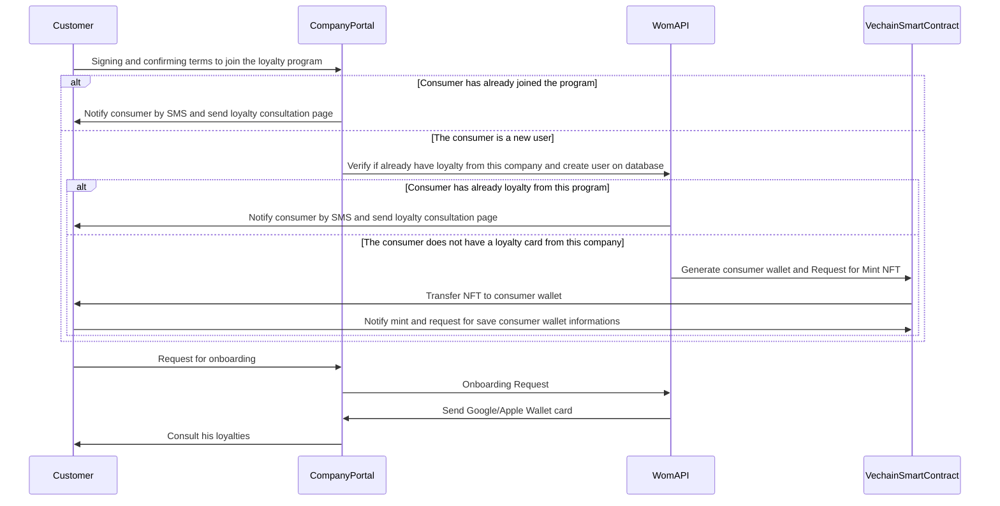

# Loyalty Program Enrollment Sequence Diagram

## Sequence Diagram Explanation

The sequence diagram depicts the interaction process for a customer enrolling in a loyalty program through the WOM platform. Here's a step-by-step walkthrough:

1. **Customer Initiation**: The process begins with the customer signing and confirming the terms to join the loyalty program through the company portal.
2. **Existing Consumer Check**: The WOM API checks if the consumer has already joined a program. If the consumer is already a member, they are notified by SMS and sent a loyalty consultation page.

3. **New Consumer Verification**: If the consumer is new, WOM API create a user on the database.

4. **Loyalty Card Check**: If the consumer already has a loyalty card from this program, they are again notified via SMS. If not, the process of generating a new loyalty card begins.

5. **NFT Wallet and Loyalty Card Creation**: The WOM API interacts with the VechainSmartContract creates a consumer wallet and mints the NFT.

6. **NFT Transfer**: The newly minted NFT is transferred to the consumer's wallet. The consumer then notifies the system, requesting with mint informations.

7. **Onboarding Completion**: Finally, the customer requests for onboarding, receives a Google/Apple Wallet card, and is able to consult their loyalties via the company portal.

## Web3 Implementation Explanation

The loyalty program is implemented using web3 technologies, which allow for decentralized applications on the blockchain. The key web3 aspects in this sequence diagram include:

- **Consumer Wallets and NFTs**: Leveraging VechainThor blockchain technology, a consumer's wallet is created, and loyalty cards are issued as NFTs. This gives a digital and transferable representation of loyalty points or rewards.

- **Vechain Smart Contracts**: These contracts, written and deployed on the VechainThor network, manage the logic for creating loyalty cards, handling the transfer of NFTs, and updating consumer information. Vechain provides the necessary tools and a robust environment to develop these smart contracts.

- **Security and Ownership**: Blockchain provides a secure ledger where transactions and NFT ownership are immutable. Consumers have full control and ownership of their loyalty cards, represented by NFTs, which can potentially increase in value or be traded.

- **Automation and Notifications**: Automated notifications via SMS or email can be set up using smart contract events and sms or email provider enhancing the communication flow with the consumers.

The implementation leverages the transparency, security, and efficiency of blockchain and smart contracts to provide a seamless and modern loyalty program experience to customers.
