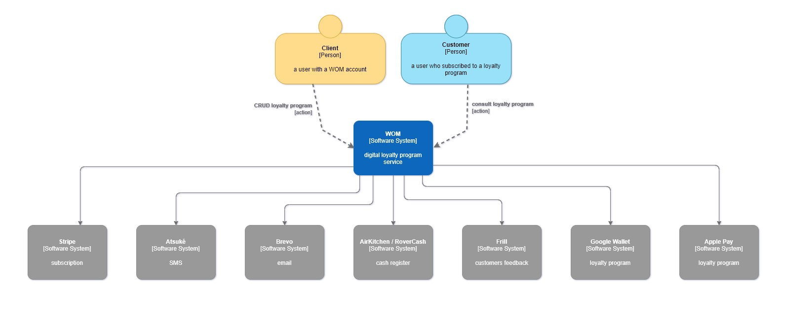

# WOM Loyalty Program Platform with Vetchain

Welcome to the WOM Loyalty Program Platform repository. WOM is revolutionizing the loyalty program landscape by leveraging web3 technology to offer a no-code, user-friendly web platform. This platform enables businesses to create, track, and manage loyalty programs with ease, while customers enjoy the benefits of digitized loyalty cards as NFTs on the blockchain.

## Project Overview

WOM aims to modernize traditional loyalty programs by digitizing loyalty cards and utilizing the security, transparency, and flexibility of blockchain technology. Built VechainThor blockchain, the platform simplifies the loyalty program creation process for businesses and provides customers with a seamless, secure way to earn and redeem rewards.

## Features

- **No-Code Platform**: Businesses can set up and customize their loyalty programs without any coding knowledge.
- **Digitized Loyalty Cards as NFTs**: Offers a unique, secure, and engaging way for customers to hold and manage loyalty rewards.
- **Blockchain-Powered Security and Efficiency**: Using the VechainThor blockchain, WOM ensures high security and operational efficiency, crucial for handling sensitive customer data and transactions.
- **Customer Engagement**: Enhances customer loyalty and engagement through a modern, digital-first approach.

This diagram represents the technical architecture of the WOM platform:

# WOM Platform Technical Architecture

The diagram illustrates the WOM platform's interactions with two types of users and various software systems.

1. There are two types of users:

   - A 'Client' represented as a person with a WOM account.
   - A 'Customer' also represented as a person, but one who subscribed to a loyalty program.

2. The WOM platform is at the center of the diagram, acting as a digital loyalty program service with Web3 integration.

3. The interactions include:

   - The 'Client' can perform CRUD (Create, Read, Update, Delete) operations on the loyalty program.
   - The 'Customer' can enroll and consult the loyalty program.

4. WOM interfaces with several software systems:
   - Stripe for subscription services.
   - AtsuKe for SMS communications.
   - Brevo for email services.
   - AirKitchen/RoverCash for cash register integration.
   - Frill for customer feedback.
   - Google Wallet and Apple Pay for push notifications.

## Vechain Tools Utilized

In this project, we leveraged a comprehensive set of tools and frameworks provided by Vechain to enhance our smart contract development and ensure robust, secure deployments. Below is a brief overview of each tool and its application within our project:

- **Connex**: The standard interface to interact with the VechainThor blockchain. It provides a streamlined way to send transactions, interact with smart contracts, and retrieve data from the blockchain.

- **Thor DevKit library**: The Thor DevKit is a specialized library crafted to support the development of decentralized applications (dApps) on the VechainThor blockchain,

- **Clauses - Multi-Task Transaction**: Enables multiple clause transactions, allowing different actions to be executed within a single transaction. This is beneficial for complex loyalty program operations that require multiple updates across various contracts.

- **VeChainThor Authority Masternode (AM)**: Ensures high-speed transaction confirmation and system security, making it suitable for high-stakes environments like loyalty programs where transaction reliability and finality are critical.

- **Insight API**: Provides real-time data from the blockchain, useful for analytics and monitoring the status of transactions and smart contracts related to loyalty programs.

By incorporating these Vechain tools into our project, we underscore our commitment to utilizing advanced blockchain technologies for efficient development and deployment. This approach ensures that the WOM Loyalty Program Platform is built on a robust and secure foundation, leveraging Vechain's powerful features to deliver a superior loyalty program experience.
