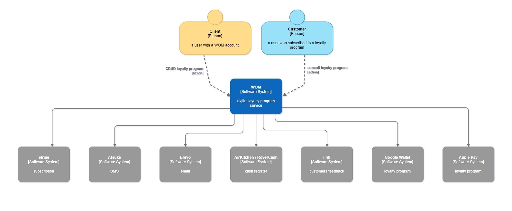

# WOM Loyalty Program Platform with Soroban

Welcome to the WOM Loyalty Program Platform repository. WOM is revolutionizing the loyalty program landscape by leveraging web3 technology to offer a no-code, user-friendly web platform. This platform enables businesses to create, track, and manage loyalty programs with ease, while customers enjoy the benefits of digitized loyalty cards as NFTs on the blockchain.

## Project Overview

WOM aims to modernize traditional loyalty programs by digitizing loyalty cards and utilizing the security, transparency, and flexibility of blockchain technology. Built on Stellar (using Soroban's capabilities), the platform simplifies the loyalty program creation process for businesses and provides customers with a seamless, secure way to earn and redeem rewards.

## Features

- **No-Code Platform**: Businesses can set up and customize their loyalty programs without any coding knowledge.
- **Digitized Loyalty Cards as NFTs**: Offers a unique, secure, and engaging way for customers to hold and manage loyalty rewards.
- **Blockchain-Powered**: Utilizes the Soroban platform on the Stellar network for unparalleled security and efficiency.
- **Customer Engagement**: Enhances customer loyalty and engagement through a modern, digital-first approach.

This diagram represents the technical architecture of the WOM platform:

# WOM Platform Technical Architecture

The diagram illustrates the WOM platform's interactions with two types of users and various software systems.

1. There are two types of users:

   - A 'Client' represented as a person with a WOM account.
   - A 'Customer' also represented as a person, but one who subscribed to a loyalty program.

2. The WOM platform is at the center of the diagram, acting as a digital loyalty program service with Web3 integration.

3. The interactions include:

   - The 'Client' can perform CRUD (Create, Read, Update, Delete) operations on the loyalty program.
   - The 'Customer' can enroll and consult the loyalty program.

4. WOM interfaces with several software systems:
   - Stripe for subscription services.
   - AtsuKe for SMS communications.
   - Brevo for email services.
   - AirKitchen/RoverCash for cash register integration.
   - Frill for customer feedback.
   - Google Wallet and Apple Pay for push notifications.

## Soroban Tools Utilized

In this project, we leveraged a comprehensive set of tools and frameworks provided by Soroban to enhance our smart contract development and ensure robust, secure deployments. Below is a brief overview of each tool and its application within our project:

- **Soroban Host-managed Auth Framework**: This tool allows us to perform transactions on smart contracts while acting as the owner. It's crucial for operations where elevated permissions are required to execute certain contract functionalities.

- **Cross Contract Call [example](https://soroban.stellar.org/docs/tutorials/cross-contract-call)**: Facilitates the interaction between different contracts on the blockchain. This feature is essential for building complex, interconnected systems where contracts need to communicate and trigger actions in each other.

- **Errors**: Demonstrates the method to define and generate understandable and manageable errors within a contract. It's vital for creating a user-friendly environment where users can easily interpret and handle contract rejections or failures.

- **Events**: Used to publish events from a contract. This feature is instrumental in notifying external observers about contract state changes, transactions, or any significant occurrences within the contract lifecycle.

- **Cargo Fuzz**: An incredible tool for conducting mutation testing, it helps in identifying weaknesses in our test cases. By improving the effectiveness of our test suite, we ensure that our unit tests are repeatable, adhering to the "R" in the FIRST principle, thus enhancing the overall quality of our software tests.

- **Single Offer Sale [example](https://github.com/stellar/soroban-examples/tree/v20.0.0/single_offer)**: Outlines how to craft a contract that enables a seller to set up an offer to sell tokens for our NFT cards during resale. It's a pivotal feature for facilitating the secondary market transactions of our NFT assets.

- **Timelock [example](https://github.com/stellar/soroban-examples/tree/v20.0.0/timelock)**: Explains how to implement a timelock mechanism, incorporating a simplified claimable balance concept. This tool is crucial for locking or unlocking offers and rewards, adding an extra layer of security and controlled access to contract functionalities.

## Deployment with Soroban CLI

To streamline the deployment of our smart contracts, we use Soroban's CLI (Command Line Interface). This tool enables us to deploy directly to Stellar with just a few commands. Here's how we use Soroban's CLI for efficient deployment.

Incorporating Soroban CLI and tools into our project documentation underscores our dedication to utilizing advanced tools for efficient development and deployment. This commitment ensures that the WOM Loyalty Program Platform is constructed on a robust and secure foundation.
