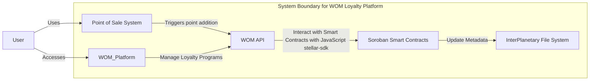

# WOM C4 Model Diagram for Loyalty Program add points



## Container Diagram Description

This diagram illustrates the container architecture for the WOM Loyalty Platform, focusing on the feature of adding loyalty points to a consumer's account. Each container represents a high-level technology or a module within the system.

- **Point of Sale System (POS):** This is where transactions occur, and loyalty points are triggered for addition. It represents the physical or virtual checkout where a consumer makes a purchase.

- **WOM Platform:** This is the core of the loyalty platform, which allows businesses to manage their loyalty programs. It's a central hub for creating, updating, and viewing loyalty cards and points.

- **WOM API:** It's the interface between the WOM Platform and the smart contracts on the blockchain. This API processes requests from the platform and communicates with the smart contracts for transactions using NodeJs [stellar-sdk](https://www.npmjs.com/package/@stellar/stellar-sdk).

- **Soroban Smart Contracts (SSC):** These are the smart contracts running on the Stellar network's Soroban platform. They handle the logic for adding, transferring, and managing loyalty points as transactions on the blockchain.

- **InterPlanetary File System (IPFS):** A decentralized storage system that holds the metadata for loyalty points and NFTs. It ensures that the data is immutable and easily retrievable in a distributed manner.

- **Consumer:** The end-user of WOM Platform, who receives loyalty points and accesses the platform to view and manage their loyalty cards.

## Implementation Example with Soroban

```rust
use soroban_sdk::{contractimpl, symbol, BigInt, Env, Symbol};

pub struct LoyaltyPointsContract;

const POINTS: Symbol = symbol_short!("POINTS");


#[contractimpl]
impl LoyaltyPointsContract {


    pub fn add_points(env: Env, amount: u32) {
        user.require_auth();
        let mut current_points u32 = env.storage().instance().get(&POINTS).unwrap_or(0);

        current_points += amount

        env.storage().instance().set(&POINTS, &current_points);

    }
}

soroban_sdk::contractexport!(LoyaltyPointsContract);
```

In this example, `initialize` not only sets the initial points but also the admin Address who is authorized to add points. The add_points function includes a call to `require_auth` to authenticate the caller and checks if the caller is the admin using [Soroban Host-managed auth framework](https://soroban.stellar.org/docs/tutorials/auth).

. If not, it panics and stops execution. This ensures that only an authorized entity can modify the points.
