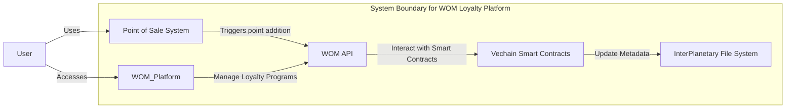

# WOM C4 Model Diagram for Loyalty Program add points



## Container Diagram Description

This diagram illustrates the container architecture for the WOM Loyalty Platform, focusing on the feature of adding loyalty points to a consumer's account. Each container represents a high-level technology or a module within the system.

- **Point of Sale System (POS):** This is where transactions occur, and loyalty points are triggered for addition. It represents the physical or virtual checkout where a consumer makes a purchase.

- **WOM Platform:** This is the core of the loyalty platform, which allows businesses to manage their loyalty programs. It's a central hub for creating, updating, and viewing loyalty cards and points.

- **WOM API:** It's the interface between the WOM Platform and the smart contracts on the blockchain. This API processes requests from the platform and communicates with the smart contracts for transactions.

- **Vechain Smart Contracts (VSC):** These are the smart contracts running on the Vechain blockchain. They handle the logic for adding, transferring, and managing loyalty points as transactions on the blockchain.

- **InterPlanetary File System (IPFS):** A decentralized storage system that holds the metadata for loyalty points and NFTs. It ensures that the data is immutable and easily retrievable in a distributed manner.

- **Consumer:** The end-user of WOM Platform, who receives loyalty points and accesses the platform to view and manage their loyalty cards.

## Implementation Example with Solidity

```solidity
pragma solidity >=0.7.0 <0.9.0;

contract LoyaltyPointsContract {
    mapping(address => uint256) private points;
    address private admin;

    constructor() {
        admin = msg.sender;
    }

    modifier onlyAdmin() {
        require(msg.sender == admin, "Unauthorized");
        _;
    }

    function addPoints(address user, uint256 amount) public onlyAdmin {
        points[user] += amount;
    }

    function getPoints(address user) public view returns (uint256) {
        return points[user];
    }
}
```

In this example, the constructor sets the admin who is authorized to add points. The addPoints function includes a call to onlyAdmin to authenticate the caller as the admin. This ensures that only an authorized entity can modify the points

. If not, it panics and stops execution. This ensures that only an authorized entity can modify the points.
