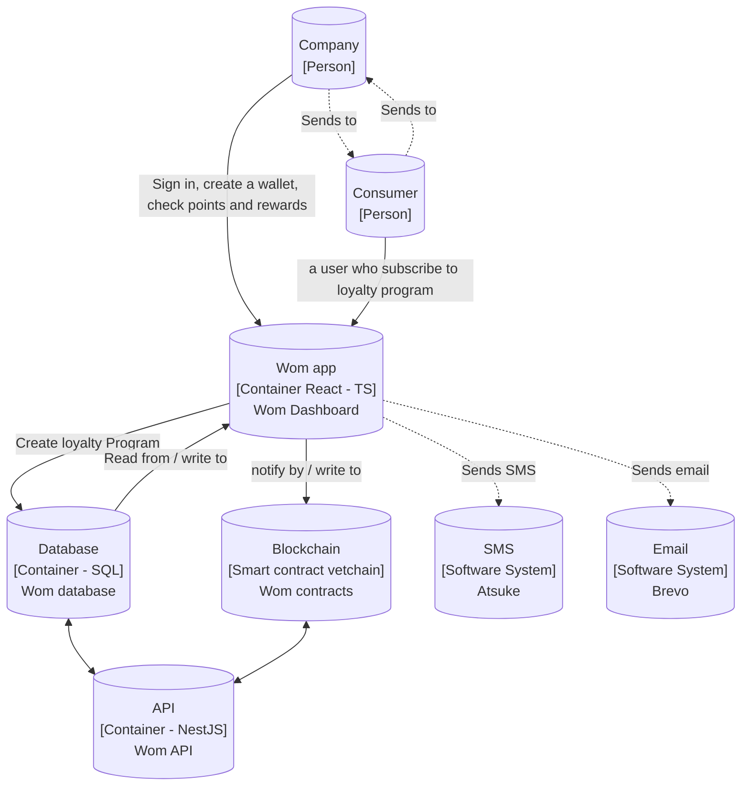

# WOM Platform Interaction Diagram

Below is a Mermaid diagram representing the interactions within the WOM platform:

## Description

The diagram illustrates the technical flow of the WOM platform as follows:

- **Company (Person):** Represents a user with a WOM account. This entity interacts with the WOM app to sign in, create a loyalty program, and check customers activities.
- **Consumer (Person):** Represents a user who subscribes to the loyalty program create by a Company. This entity also interacts with the WOM app.
- **Wom App (Container):** The central interface, built with React and TypeScript.
- **Wom API (Container):** The central node in the system, built with NestJs and TypeScript.
- **Database (Container):** A SQL-based container that the WOM app reads from and writes to.
- **Blockchain (Smart contract vetchain):** A blockchain element that interacts with the WOM app through notifications and read/write operations.
- **SMS (Software System):** Represented by Atsuke, it sends SMS messages as part of the platform's operations.
- **Email (Software System):** Represented by Brevo, it sends emails as part of the platform's operations.

All components are styled with specific colors to differentiate between persons, software systems, containers, databases, and blockchain elements.
