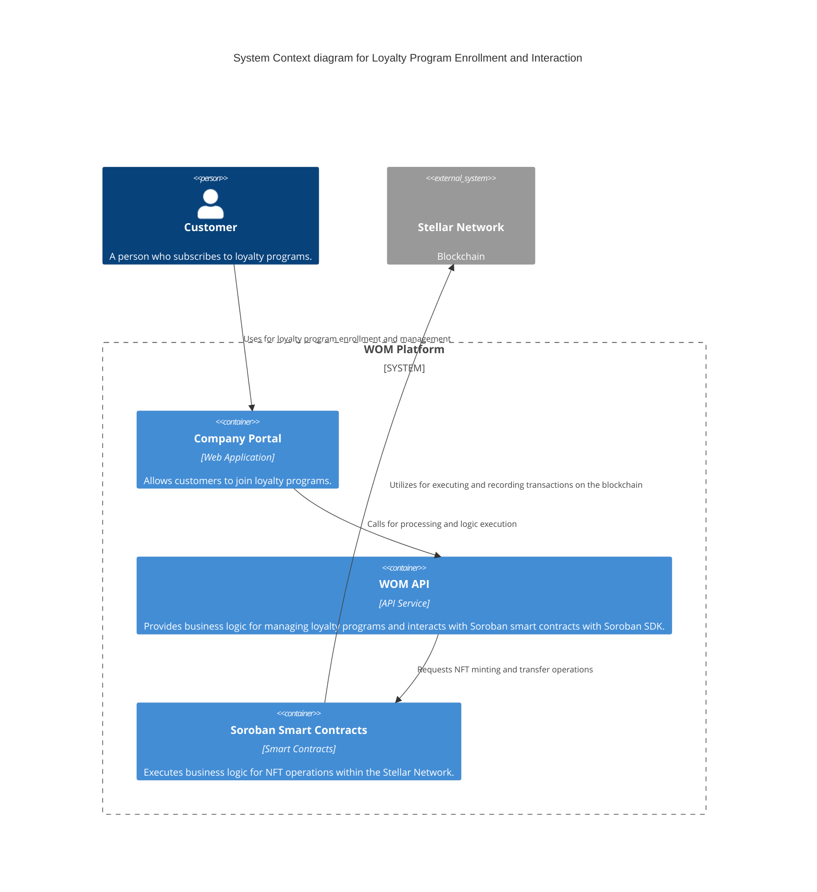

# C4 Model Diagram for Loyalty Program Enrollment


```mermaid
C4Container
  title System Context diagram for Loyalty Program Enrollment and Interaction

  Person(customer, "Customer", "A person who subscribes to loyalty programs.")
  System_Ext(stellar, "Stellar Network", "Blockchain", "Enables decentralized control and ownership proof of NFTs.")

  System_Boundary(comp, "WOM Platform") {

      Container(companyPortal, "Company Portal", "Web Application", "Allows customers to join loyalty programs.")
      Container(womAPI, "WOM API", "API Service", "Provides business logic for managing loyalty programs and interacts with Soroban smart contracts with Soroban SDK.")
      Container(sorobanContracts, "Soroban Smart Contracts", "Smart Contracts", "Executes business logic for NFT operations within the Stellar Network.")

  }

  Rel(customer, companyPortal, "Uses for loyalty program enrollment and management")
  Rel(companyPortal, womAPI, "Calls for processing and logic execution")
  Rel(womAPI, sorobanContracts, "Requests NFT minting and transfer operations")
  Rel(sorobanContracts, stellar, "Utilizes for executing and recording transactions on the blockchain")

```

### Enrollment and NFT Minting

- The enrollment process initiates when a new consumer interacts with the company. WOM API manages the process, verifying consumer data and instructing the Stellar smart contract to mint the NFT.
- The minting process is authenticated and recorded on the Stellar Network, ensuring transparency and security.

### Secure Transfer of NFTs

- Soroban's Host-managed authentication framework ensures that only authorized users can transfer NFTs. It abstracts the complexities of signature handling and authorization, providing a simple blockchain address authentification integration.
- Transfers are logged on the Stellar blockchain, providing immutable proof of ownership and transaction history.

### OrbitDB for Off-Chain Data

- While blockchain handles the immutable transactions and ownership records, OrbitDB can be used in conjunction with Soroban to manage off-chain data. This distributed database is a peer-to-peer, serverless, database engine that uses IPFS as its data storage and allows for database interoperability in the decentralized web.

### Interactions

1. Customers interact with the company for loyalty program enrollment.
2. The Company Portal interacts with the WOM API for processing and executing business logic.
3. The WOM API reads from and writes to the Loyalty Database to manage customer and loyalty program data.
4. It also requests the Soroban Smart Contracts for NFT minting and transfer operations.
5. These smart contracts utilize the Stellar Network to execute and record transactions on the blockchain.
6. The Stellar Network confirms NFT ownership and transactions back to the Wom API and Wom API send an Sms to the customers.

## Implementation Example with Soroban

A basic Soroban smart contract for managing NFT-based loyalty cards could include functions for minting new NFTs for loyalty cards, transferring ownership of NFTs to customers, and send an event. Here's a conceptual Rust code snippet for such operations:

```rust
use soroban_auth::{Identifier, Signature};
use soroban_sdk::{contractimpl, symbol, Env, Address, Bytes};


pub struct NonFungibleToken;


pub struct LoyaltyCardContract;


pub(crate) fn mint(e: &Env, to: Identifier, id: i128) {
    let topics = (symbol!("mint"), to);
    e.events().publish(topics, id);
}

#[contractimpl]
impl LoyaltyCardContract for NonFungibleToken {

      fn mint_card(env: Env, admin: Signature, to: Identifier, id: i128) {
        check_admin(&env, &admin);

        write_balance(&env, to.clone(), WriteType::Add);
        write_owner(&env, id, to.clone());
        increment_supply(&env);

        // Create psuedo randomness.
        let uri = get_rand_uri(&env);
        write_token_uri(&env, id, uri);

        event::mint(&env, to, id)
    }
    // Implementation of the NonFungibleToken interface ...
}

```

# LoyaltyCardContract Description

This document outlines the functionalities and structure of the `LoyaltyCardContract`, a Soroban smart contract for a blockchain-based loyalty card system, leveraging the Soroban SDK for development on the Stellar network.

## Components and Functionalities

- **NFT-Based Loyalty Cards**: Implements a non-fungible token system where each loyalty card is unique, represented as an NFT.
- **Minting Functionality**: Provides secure functions to mint new loyalty cards, allowing businesses to issue new cards to customers as part of their loyalty programs.
- **Event Publishing**: Utilizes Soroban's event system to publish events related to the minting of loyalty cards, enhancing transparency and traceability.
- **Admin Verification**: Includes an admin verification step in the card minting process, ensuring that only authorized personnel can issue new loyalty cards.
- **Balance and Ownership Management**: Manages the balance and ownership records of loyalty cards, ensuring accurate tracking of card distribution and ownership.
- **Supply Management**: Supports the increment of the total supply of loyalty cards upon the minting of new cards, helping businesses keep track of the total number of cards in circulation.

## Key Components

- `NonFungibleToken`: The base structure representing the NFT aspect of the loyalty cards.
- `LoyaltyCardContract`: The main contract structure implementing the loyalty card functionality.
- `mint_card`: A function to mint new loyalty cards, updating events, balances, and ownership records.
- `SorobanAuth` and `SorobanSDK`: Utilizes Soroban's authentication and SDK for secure contract implementation and interaction with the Stellar network.

Ref: [Soroban Example](https://github.com/altugbakan/sorodogs/tree/main/contracts)
