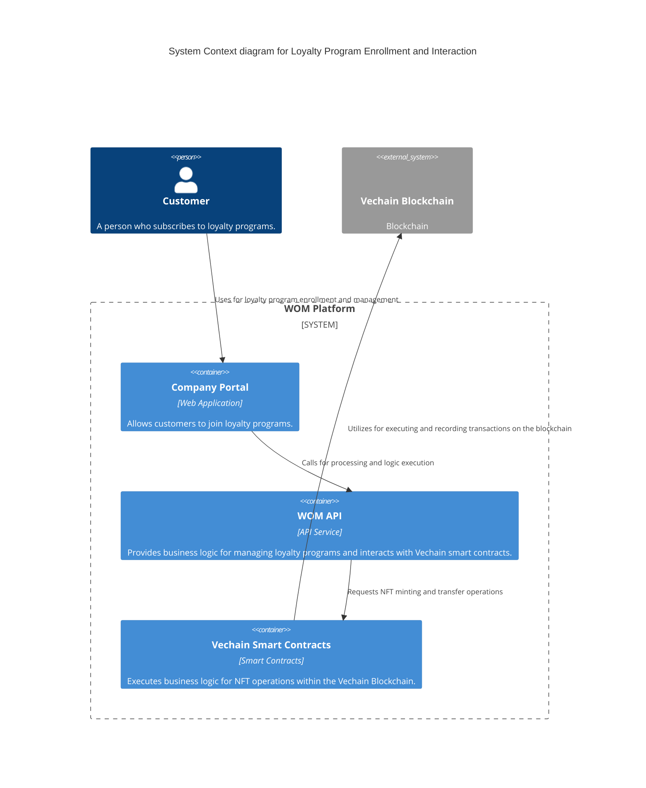

# C4 Model Diagram for Loyalty Program Enrollment



### Enrollment and NFT Minting

- The enrollment process initiates when a new consumer interacts with the company. WOM API manages the process, verifying consumer data and instructing the Vechain smart contract to mint the NFT.
- The minting process is authenticated and recorded on the VechainThor Network, ensuring transparency and security.

### Interactions

1. Customers interact with the company for loyalty program enrollment.
2. The Company Portal interacts with the WOM API for processing and executing business logic.
3. The WOM API reads from and writes to the Loyalty Database to manage customer and loyalty program data.
4. It also requests the Vechain Smart Contracts for NFT minting and transfer operations.
5. These smart contracts utilize the VechainThor Network to execute and record transactions on the blockchain.
6. The VechainThor Network confirms NFT ownership and transactions back to the Wom API and Wom API send an Sms to the customers.

## Implementation Example with Vechain

A basic Vechain smart contract for managing NFT-based loyalty cards might include functions for minting new NFTs for loyalty cards, transferring ownership of NFTs to customers, and sending an event. Here's a conceptual Solidity code snippet for such operations:

```solidity
pragma solidity ^0.8.0;

import "@openzeppelin/contracts/token/ERC20/ERC20.sol";

contract LoyaltyToken is ERC20 {
    address public admin;

    constructor() ERC20("LoyaltyToken", "LOYT") {
        admin = msg.sender;
    }

    modifier onlyAdmin() {
        require(msg.sender == admin, "Only admin can perform this action");
        _;
    }

    function mint(address to, uint256 amount) public onlyAdmin {
        _mint(to, amount);
    }

    function burn(address from, uint256 amount) public onlyAdmin {
        _burn(from, amount);
    }
}
```

# LoyaltyCardContract Description

This document outlines the functionalities and structure of the LoyaltyCardContract, a Vechain smart contract for a blockchain-based loyalty card system:

## Components and Functionalities

- **ERC-20 Loyalty Tokens**: Implements the ERC-20 standard for token creation, providing a uniform set of functionalities for issuing and managing loyalty tokens.
- **Minting Functionality**: Allows the admin to mint new tokens, enabling businesses to issue loyalty points as part of their programs.
- **Burning Functionality:**: Allows the admin to burn tokens, facilitating the management of token supply and redemption of loyalty points.
- **Admin Verification**: Ensures that token minting and burning can only be performed by authorized personnel, securing the token supply against unauthorized access.
